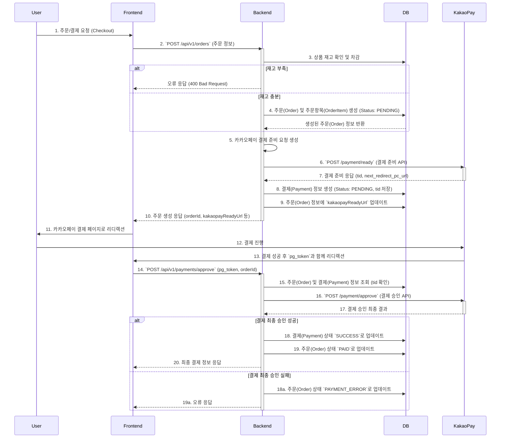

# Commerce Project Backend (CMC)

본 문서는 CMC 백엔드 서버의 API 명세와 내부 프로세스를 설명합니다.

## 1. 주요 기술 스택

- **Framework**: Spring Boot
- **Language**: Java 11
- **Build Tool**: Gradle
- **Database**: MySQL (JPA/Hibernate)
- **API Documentation**: OpenAPI 3 (Swagger)

---

## 2. API 프로세스 및 명세

### 2.1 상품 (Products)

#### `GET /api/v1/products`

-   **정의**: 상품 목록을 검색, 필터링, 정렬하여 조회합니다.
-   **프로세스**:
    1.  사용자 요청 (키워드, 가격 범위, 정렬, 페이지네이션)을 받습니다.
    2.  `ProductRepository`를 통해 동적 쿼리를 생성하여 DB에서 조건에 맞는 상품 목록을 조회합니다.
    3.  조회된 상품 목록과 페이징 정보를 `ProductListResponseDto`로 변환하여 반환합니다.
-   **DB 상호작용**: `product` 테이블에서 `SELECT` 쿼리를 실행합니다.

#### `GET /api/v1/products/{productId}`

-   **정의**: 특정 상품의 상세 정보를 조회합니다.
-   **프로세스**:
    1.  `productId`를 Path Variable로 받습니다.
    2.  `ProductRepository`를 통해 해당 ID의 상품을 DB에서 조회합니다.
    3.  상품이 존재하지 않으면 404 에러를 반환합니다.
    4.  조회된 상품 정보를 `ProductDetailDto`로 변환하여 반환합니다.
-   **DB 상호작용**: `product` 테이블에서 특정 `id`로 `SELECT` 쿼리를 실행합니다.

---

### 2.2 주문 및 결제 (Orders & Payments)

주문과 결제는 하나의 트랜잭션으로 처리되며, 카카오페이 API와 연동됩니다.

#### 전체 프로세스 다이어그램 (Mermaid)

#### `POST /api/v1/orders` (주문 생성 및 결제 준비)

-   **정의**: 장바구니의 상품들과 배송지 정보를 받아 주문을 생성하고, 카카오페이 결제를 준비합니다.
-   **프로세스**:
    1.  `OrderRequestDto` (상품 ID, 수량, 배송지 정보 등)를 받습니다.
    2.  **재고 확인**: 요청된 상품들의 재고를 DB에서 확인하고, 주문 수량만큼 차감합니다. (부족 시 에러)
    3.  **주문 생성 (DB 저장)**:
        -   `orders` 테이블: 주문 정보를 저장합니다. `order_status`는 `PENDING`으로 설정됩니다.
        -   `order_item` 테이블: 주문에 포함된 각 상품 정보를 저장합니다.
    4.  **결제 준비**:
        -   저장된 주문 정보를 바탕으로 카카오페이 결제 준비 API를 호출합니다.
        -   카카오페이로부터 `tid` (결제 고유번호)와 `next_redirect_pc_url` (결제 페이지 URL)을 받습니다.
    5.  **결제 정보 생성 (DB 저장)**:
        -   `payment` 테이블: 결제 정보를 저장합니다. `status`는 `PENDING`으로, `kakao_tid`는 발급받은 `tid`로 저장됩니다.
    6.  **응답**: `OrderResponseDto` (주문 ID, 결제 페이지 URL 등)를 반환합니다.

-   **DB 저장 정보**:
    -   `orders`: `id`, `order_date`, `order_status` (`PENDING`), `total_product_amount`, `shipping_amount`, `payment_amount`, `payment_due_date`, 배송지 정보, `kakaopay_ready_url` 등
    -   `order_item`: `order_id`, `product_id`, `price`, `quantity`
    -   `payment`: `id`, `order_id`, `status` (`PENDING`), `payment_method` (`KAKAO_PAY`), `amount`, `kakao_tid`

#### `POST /api/v1/payments/approve` (결제 승인)

-   **정의**: 카카오페이에서 결제 성공 후 받은 `pg_token`으로 최종 결제를 승인합니다.
-   **프로세스**:
    1.  `orderId`와 `pg_token`을 쿼리 파라미터로 받습니다.
    2.  DB에서 `orderId`로 `payment` 정보를 조회하여 `tid`를 확인합니다.
    3.  카카오페이 결제 승인 API를 `tid`, `pg_token` 등과 함께 호출합니다.
    4.  최종 승인 성공 시, DB 상태를 업데이트합니다.
-   **DB 저장 정보**:
    -   `payment` 테이블: `status`를 `SUCCESS`로, `paid_at` (결제일시), `pg_token`을 업데이트합니다.
    -   `orders` 테이블: `order_status`를 `PAID`로 업데이트합니다.

---
## 3. 주요 도메인 엔티티

- **Product**: 상품 정보
- **Order**: 주문 정보 (주문 상태, 금액, 배송지 등)
- **OrderItem**: 주문에 포함된 개별 상품 (상품, 가격, 수량)
- **Payment**: 결제 정보 (결제 상태, 금액, 수단, 카카오페이 tid 등)

각 엔티티는 서로 관계를 맺고 있으며, 주문-결제 프로세스 전반에 걸쳐 데이터가 생성되고 업데이트됩니다. 