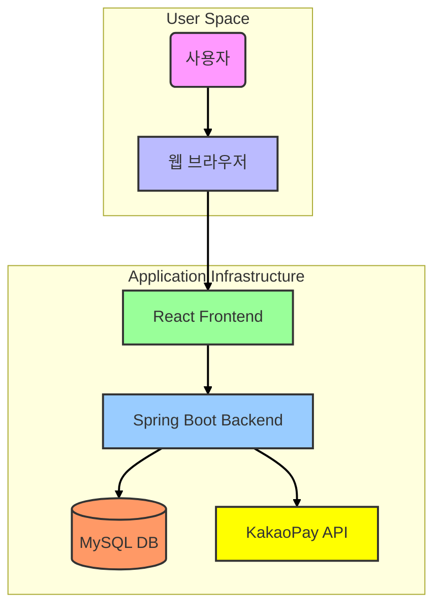

# 시스템 아키텍처 다이어그램

이 문서는 Commerce 프로젝트의 전체적인 아키텍처를 설명합니다.

## 고수준 아키텍처

아래 다이어그램은 사용자가 웹 브라우저를 통해 우리 시스템과 상호작용하고, 백엔드 시스템이 데이터베이스 및 외부 카카오페이 API와 통신하는 과정을 보여줍니다.

### 컴포넌트 설명

-   **사용자 (User)**: 상품을 구매하고 결제하는 시스템의 최종 사용자입니다.
-   **웹 브라우저 (Web Browser)**: 사용자가 프론트엔드 애플리케이션과 상호작용하는 인터페이스입니다.
-   **React Frontend**:
    -   사용자에게 UI를 제공하는 싱글 페이지 애플리케이션(SPA)입니다.
    -   상품 조회, 장바구니 관리, 주문 생성 등의 기능을 수행합니다.
    -   백엔드 API와 HTTP 통신을 통해 데이터를 주고받습니다.
-   **Spring Boot Backend**:
    -   비즈니스 로직을 처리하는 핵심 서버 애플리케이션입니다.
    -   상품, 주문, 결제 관련 RESTful API를 제공합니다.
    -   데이터베이스에 모든 데이터를 저장하고 관리합니다.
    -   결제 처리를 위해 외부 카카오페이 API와 연동합니다.
-   **MySQL DB**:
    -   상품, 주문, 결제 등 모든 영속적인 데이터를 저장하는 관계형 데이터베이스입니다.
-   **KakaoPay API**:
    -   카카오페이 결제를 처리하기 위한 외부 서비스입니다.
    -   백엔드 서버는 결제 준비 및 승인 요청을 위해 카카오페이 API와 통신합니다.

### 주요 상호작용 흐름 (결제 예시)

1.  **사용자**가 **브라우저**에서 상품을 주문하고 '결제하기' 버튼을 클릭합니다.
2.  **Frontend**는 주문 정보를 담아 **Backend**의 주문 생성 API를 호출합니다.
3.  **Backend**는 주문 정보를 **DB**에 저장하고, 카카오페이 결제 준비 API(` /payments/ready`)를 호출합니다.
4.  **Backend**는 **KakaoPay API**와 통신하여 결제 준비를 마치고, 결제 페이지 URL을 받습니다.
5.  **Backend**는 결제 페이지 URL을 **Frontend**에 전달합니다.
6.  **Frontend**는 사용자를 카카오페이 결제 페이지로 리디렉션합니다.
7.  결제가 완료되면, 사용자는 우리 서비스의 성공 페이지로 돌아옵니다. 이때 **Frontend**는 **Backend**의 결제 승인 API(`/payments/approve`)를 호출합니다.
8.  **Backend**는 다시 **KakaoPay API**와 통신하여 결제를 최종 승인하고, 결과를 **DB**에 업데이트합니다.
9.  **Frontend**는 사용자에게 최종 결제 완료 화면을 보여줍니다. 