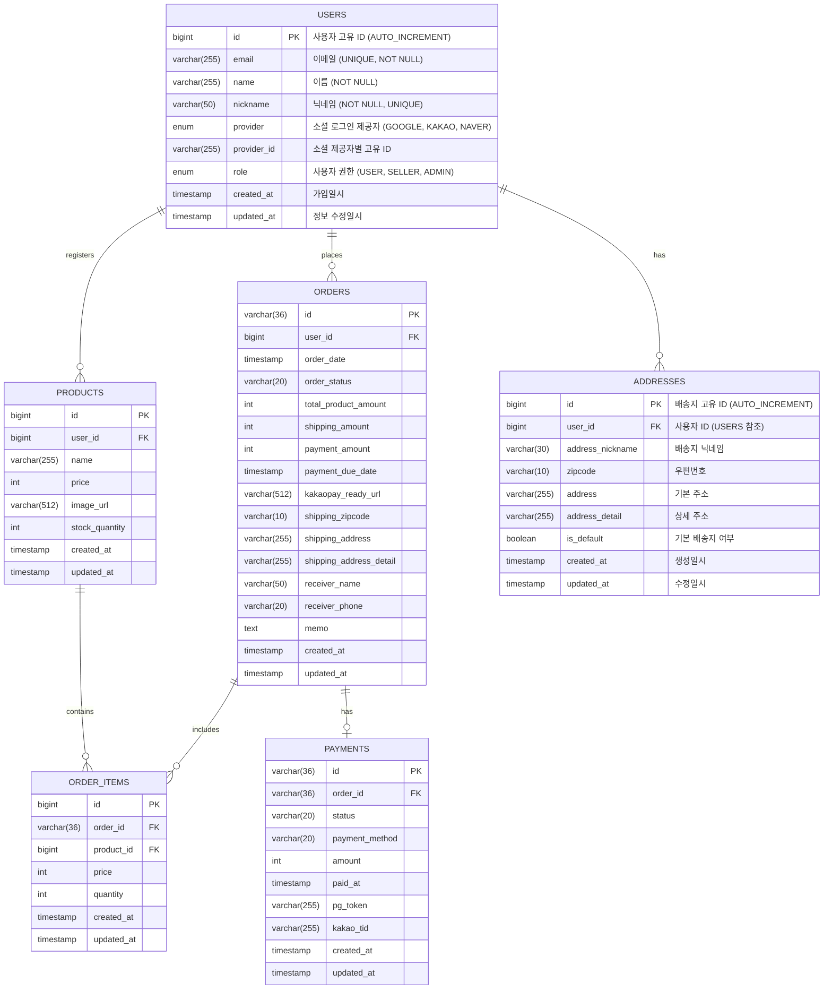

# 제안된 데이터베이스 구조 변경안 (ERD)

회원 시스템, 사용자 상품 등록, 배송지 관리 기능을 추가함에 따라 데이터베이스 구조는 다음과 같이 변경될 것을 제안합니다.

## 변경 요약

1.  **`USERS` 테이블**: 닉네임(`nickname`) 컬럼 추가.
2.  **`ADDRESSES` 테이블 신규 추가**: 각 유저가 최대 5개의 배송지를 저장할 수 있도록 설계. 배송지 닉네임, 기본 배송지 여부 포함.
3.  **`PRODUCTS`/`ORDERS` 테이블**: 기존과 동일하게 유저와의 관계 유지.

## 제안 ERD

## 관계 설명
- USERS ↔ ADDRESSES (1:N): 한 유저는 최대 5개의 배송지를 가질 수 있음. 각 배송지는 닉네임을 가짐. 한 배송지만 기본 배송지로 설정 가능.
- USERS ↔ PRODUCTS/ORDERS: 기존과 동일. 