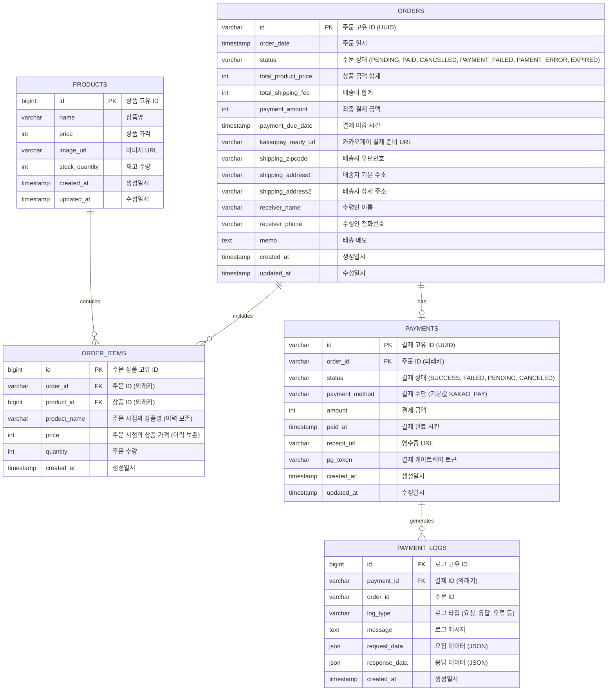

# ERD

```mermaid
erDiagram
    PRODUCTS ||--o{ ORDER_ITEMS : "contains"
    ORDERS ||--o{ ORDER_ITEMS : "includes"
    ORDERS ||--o| PAYMENTS : "has"
    PAYMENTS ||--o{ PAYMENT_LOGS : "generates"

    PRODUCTS {
        bigint id PK "상품 고유 ID"
        varchar name "상품명"
        int price "상품 가격"
        varchar image_url "이미지 URL"
        int stock_quantity "재고 수량"
        timestamp created_at "생성일시"
        timestamp updated_at "수정일시"
    }

    ORDERS {
        varchar id PK "주문 고유 ID (UUID)"
        timestamp order_date "주문 일시"
        varchar status "주문 상태 (PENDING, PAID, CANCELLED, PAYMENT_FAILED, PAMENT_ERROR, EXPIRED)"
        int total_product_price "상품 금액 합계"
        int total_shipping_fee "배송비 합계"
        int payment_amount "최종 결제 금액"
        timestamp payment_due_date "결제 마감 시간"
        varchar kakaopay_ready_url "카카오페이 결제 준비 URL"
        varchar shipping_zipcode "배송지 우편번호"
        varchar shipping_address1 "배송지 기본 주소"
        varchar shipping_address2 "배송지 상세 주소"
        varchar receiver_name "수령인 이름"
        varchar receiver_phone "수령인 전화번호"
        text memo "배송 메모"
        timestamp created_at "생성일시"
        timestamp updated_at "수정일시"
    }

    ORDER_ITEMS {
        bigint id PK "주문 상품 고유 ID"
        varchar order_id FK "주문 ID (외래키)"
        bigint product_id FK "상품 ID (외래키)"
        varchar product_name "주문 시점의 상품명 (이력 보존)"
        int price "주문 시점의 상품 가격 (이력 보존)"
        int quantity "주문 수량"
        timestamp created_at "생성일시"
    }

    PAYMENTS {
        varchar id PK "결제 고유 ID (UUID)"
        varchar order_id FK "주문 ID (외래키)"
        varchar status "결제 상태 (SUCCESS, FAILED, PENDING, CANCELED)"
        varchar payment_method "결제 수단 (기본값 KAKAO_PAY)"
        int amount "결제 금액"
        timestamp paid_at "결제 완료 시간"
        varchar receipt_url "영수증 URL"
        varchar pg_token "결제 게이트웨이 토큰"
        timestamp created_at "생성일시"
        timestamp updated_at "수정일시"
    }

    PAYMENT_LOGS {
        bigint id PK "로그 고유 ID"
        varchar payment_id FK "결제 ID (외래키)"
        varchar order_id "주문 ID"
        varchar log_type "로그 타입 (요청, 응답, 오류 등)"
        text message "로그 메시지"
        json request_data "요청 데이터 (JSON)"
        json response_data "응답 데이터 (JSON)"
        timestamp created_at "생성일시"
    }


```