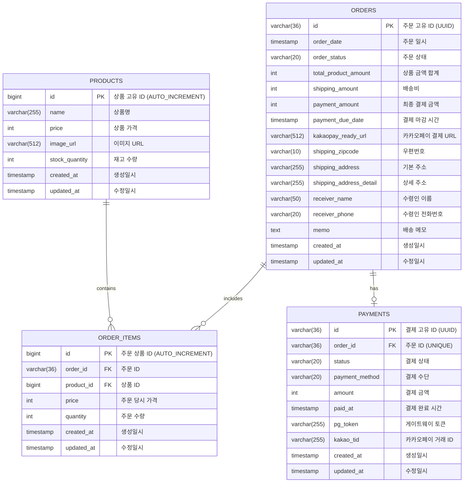

# ERD (Entity Relationship Diagram)

## 데이터베이스 구조

## 인덱스 정보

### PRODUCTS 테이블
- `idx_product_name`: 상품명 검색을 위한 인덱스
- `idx_product_price`: 가격 범위 검색을 위한 인덱스

### ORDERS 테이블
- `idx_order_status`: 주문 상태별 조회를 위한 인덱스
- `idx_order_date`: 주문 일시별 조회를 위한 인덱스
- `idx_payment_due_date`: 결제 마감 시간별 조회를 위한 인덱스

### ORDER_ITEMS 테이블
- `idx_order_id`: 주문별 상품 조회를 위한 인덱스
- `idx_product_id`: 상품별 주문 조회를 위한 인덱스

### PAYMENTS 테이블
- `idx_payment_status`: 결제 상태별 조회를 위한 인덱스
- `unq_order_id`: 주문당 하나의 결제만 허용하는 유니크 인덱스

## 관계 설명

1. **PRODUCTS ↔ ORDER_ITEMS**: 일대다 관계
   - 하나의 상품은 여러 주문에 포함될 수 있음
   - 주문 상품 삭제 시 상품은 삭제되지 않음 (RESTRICT)

2. **ORDERS ↔ ORDER_ITEMS**: 일대다 관계
   - 하나의 주문은 여러 상품을 포함할 수 있음
   - 주문 삭제 시 관련 주문 상품도 함께 삭제됨 (CASCADE)

3. **ORDERS ↔ PAYMENTS**: 일대일 관계
   - 하나의 주문은 하나의 결제만 가질 수 있음 (UNIQUE 제약)
   - 주문 삭제 시 결제는 삭제되지 않음 (RESTRICT)

## 주문 상태 설명

- **PENDING**: 주문 생성, 결제 대기 상태
- **PAID**: 결제 완료 상태
- **CANCELLED**: 주문 취소 상태
- **PAYMENT_FAILED**: 결제 실패 상태
- **PAYMENT_ERROR**: 결제 검증 실패 상태
- **EXPIRED**: 주문 만료 상태 (30분 내 미결제)

## 결제 상태 설명

- **SUCCESS**: 결제 성공
- **FAILED**: 결제 실패
- **PENDING**: 결제 대기
- **CANCELED**: 결제 취소
